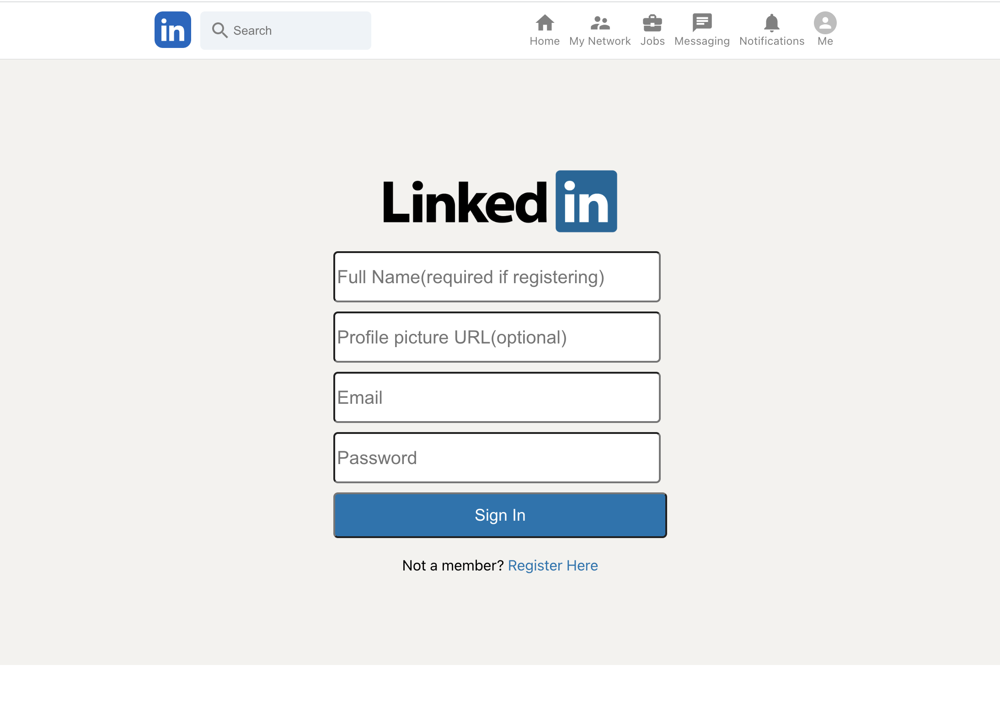
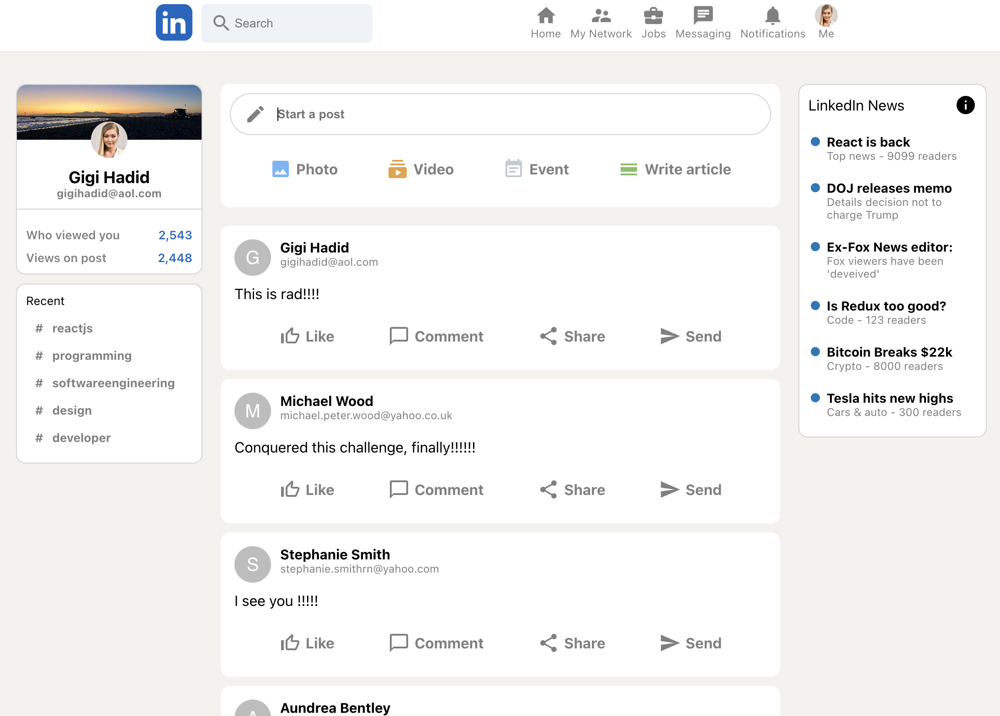

#  LinkedIn Clone

## Description
This is a clone of LinkedIn.

You will be able to register and login to the site. The registation page asks for your name, email, password and a photo url. We are using Firebase as our backend. We get our authentication ability from Firebase.

Once you are logged in, you will be able to see your profile page. This page will show you your name, email, photo url, and a list of all the people you are currently connected to. You can also post a message.

## Requirements

NPM, ReactJS, React Redux, Firebase, Material UI, React-Flip-Move

## Technologies & Methods Used

React.JS, React Redux, Firebase, Firestore, Authentication, Material UI

## Github Repository

https://github.com/sphcastillo/linkedin_clone

## Deployed Site

https://linkedin-backend-c08f2.web.app

## More info

Author: Sophia Castillo,

Email: Sphcastillo@gmail.com,

Professional website: www.builtbysophia.com,

GitHub: https://github.com/sphcastillo,

LinkedIn: https://www.linkedin.com/in/sophia-castillo-b89124133/

